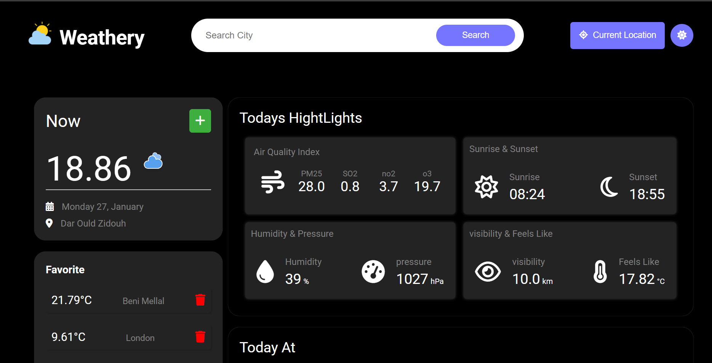

  
 
 
 
 

# Weather App 
 

🌦️ **Get Weather Info By City Name** 🌦️  

⭐⭐⭐⭐⭐  

<ul>
  <li> <b>Responsive Web-App</b>  to get weather info</li>
   <li> <b>Developed using:</b> HTML5, CSS3, SASS, JavaScript. </li>
   <li><b>Styling:</b> Beautifully crafted with SASS.</li>
  <li><b>Deployed on:</b> Github  </li>
  <li><b>Live Demo:</b> [https://karaniabdellah.github.io/weather_app/](#).</li>
</ul>

### Screenshots :

I would be happy if you contribute to this project! 🙌

*❤️ made with love by abdellah karani ❤️*

A weather app that provides weather information by typing the name of a city. It includes features like adding to favorites and dark mode.

